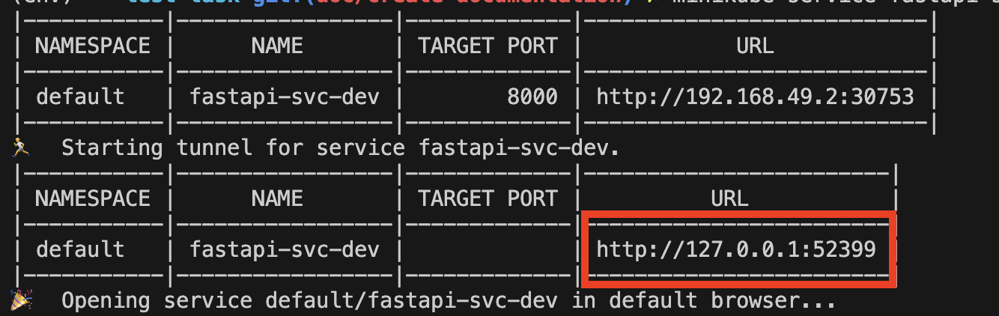

# test-task

## Content
1) Project structure
2) Installation
3) Endpoint
4) Comments and Improvements

## Project structure

```
spike_challenge
├── README.md
├── api
│   ├── main.py
│   └── requirements.txt
├── data                                # Files for training the RNN model
├── artifacts                           # Store the model and other artifacts
├── model_package                       # Python package for training and preprocessing
│   ├── model
│   │   ├── __init__.py
│   │   ├── __main__.py
│   │   ├── classifier.py
│   │   ├── constants.py
│   │   ├── prediction.py
│   │   ├── training.py
│   │   └── utils.py
│   ├── tests
│   ├── requirements-test.txt
│   ├── requirements.txt
│   └── setup.py
├── infra/chart_api                      # Helm files
│   ├── templates
│   ├── Chart.yaml
│   ├── values.dev.yaml
│   ├── values.prod.yaml
│   └── values.yaml
├── .pre-commit-config.ini
├── pytest.ini
└── Dockerfile
```

## Installation
- [Not necessary] If you wanna train the model from scratch, run these commands (This step is not necessary since the artifacts are in the repo):
```
pip install -e model_package 
python -m model training_model artifacts data/names
```
- [Not necessary] In case, you wanna run the api locally without K8s:
```
docker build -t fastapi-ml -f Dockerfile . 
docker run -p 8000:8000 fastapi-ml
```
- To run the API in K8s, make sure to install local kubernetes cluster. Follow these CLI commands:
```
brew install helm
helm install api-chart . -f values.dev.yaml
```
- Check the deployment succeded:
```
kubectl get deployments
```
- Create a URL for the service, for this example I used minikube:
```
minikube service fastapi-svc-dev
```
- Important! After running the command above, make sure to use the port to sent requests to the api.


## Endpoint
Note: The port could change depending on the port assigned by minikube
### Health check
Send a request to this route to verify the service is running

**URL** : `localhost:[port ! 8000]/check_service`

**Method** : `GET`

#### Example

```
curl --location --request GET 'localhost:8000/check_service'
```

#### Response

**Code** : `200 OK`

```json
{
    "Message":"Hello world from service"
}
```

### Prediction
Get the prediction given a name

**URL** : `localhost:[port ! 8000]/get_prediction`

**Method** : `POST`

#### Data
- name: The input name for the model
- n_predictions: The top K classes returned by the endpoint

#### Example

```
curl --location --request POST 'localhost:62380/get_prediction' \
    --header 'Content-Type: application/json' \
    --data-raw '{"name": "Jordan","n_predictions": 2}' 
```

#### Response

**Code** : `200 OK`

```json
{
    "predictions": ["English","Irish"],
    "probabilities": [-1.2419129610061646,-1.9099189043045044]
}
```

## Comments and Improvements
- Use a tool to monitor metrics of the API such as latency, error count.
- Integrate a tool to send alerts if a SLO was achieved, for example, if the average latency in the last day was higher than 15sec
- Use an orchestration tool such as Airflow or Kubeflow to automate the training pipeline
